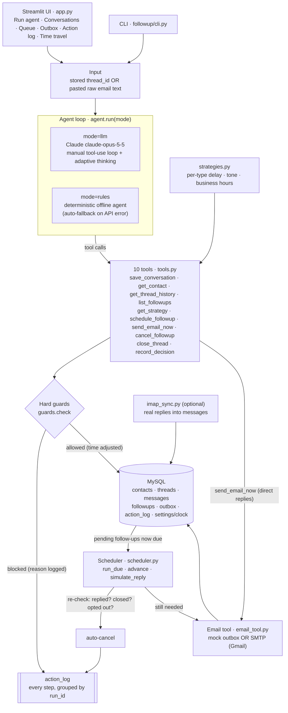

# Follow-Up Agent: autonomous AI email follow-ups that know when to stay quiet

**PS-053 "AI Email Follow-Up Agent", Team AGT-018**

Follow-ups usually go wrong in one of two ways. Either nobody sends them, or they go out when they shouldn't: after the client has already replied, twice in one day, at 2 AM in the recipient's timezone, or to someone who asked to be removed. You give this agent an email thread, either one already stored or raw text you paste in. **Claude (`claude-opus-5-5`)** reads the full history through tools and decides whether a follow-up is warranted. It picks a time inside the recipient's business hours, writes the message in a tone that suits a customer, student, employee or business partner, and then queues it or sends it through an email tool (a mock outbox, or real Gmail SMTP). Every step is written to an action log. **The LLM proposes and the code decides.** The duplicate and anti-spam rules are enforced in Python, not in the prompt. Just before each send, the scheduler checks the thread again, so a follow-up is cancelled automatically if the recipient replied, opted out or the thread was closed in the meantime. If the Claude API is unreachable, a deterministic rules agent takes over. It uses the same tools, guards and log, so the demo can't get stuck.

---

## 1. Requirement checklist

| # | PS-053 requirement | How we meet it | Where (file / function) |
|---|---|---|---|
| 1 | **Analyze a conversation** | The agent accepts a stored `thread_id` or raw pasted text. From pasted text, Claude extracts the contact, contact type, subject, and each message's direction and UTC time, then stores the thread. The offline parser does the same using From/To/Date/Subject headers. | `agent.run(thread_id=… \| text=…)`, `tools.save_conversation`, `rule_agent.parse_raw` |
| 2 | **Decide if a follow-up is needed** | Claude checks whether the recipient replied, whether the thread is resolved or declined, whether they asked a question, and whether they promised an update. Hard rules in code can still veto its decision. | `agent.SYSTEM_PROMPT` (step 3), `guards.check` |
| 3 | **Determine when** | Waits the per-type delay after our last message. A deadline pulls the time earlier. There is always a gap of at least 24 h, and the time is moved into the recipient's local Mon–Fri 09:00–18:00. | `tools.get_strategy`, `strategies.suggest_send_at`, `strategies.next_business_slot` |
| 4 | **Draft the follow-up** | Claude writes in the strategy's tone, length and focus. It uses only facts from the thread, includes one call to action and keeps the `Re: <subject>` subject line. Rules mode fills per-type templates instead. | `agent.SYSTEM_PROMPT` (step 4), `strategies.STRATEGIES`, `rule_agent.draft` |
| 5 | **Schedule or send via an email tool** | `schedule_followup` adds the message to the queue, and `send_email_now` sends direct replies immediately. The scheduler delivers queued follow-ups when they are due. | `tools.schedule_followup`, `tools.send_email_now`, `scheduler.run_due` → `tools.deliver` → `email_tool.send` |
| 6 | **Avoid duplicate / unnecessary messages** | Seven blocking rules in code, a re-check at send time, and de-duplication of pasted messages (see [Hard guards](#hard-guards-enforced-in-code)). | `guards.check`, `scheduler._cancel_reason`, `tools.save_conversation` |
| 7 | **Check previous communication** | Before deciding, the agent reads the full thread plus a summary: who wrote last, follow-ups already sent, and anything pending. It also reads the contact's follow-ups across all threads. | `tools.get_thread_history`, `tools.list_followups`, `tools.get_contact`, `guards.thread_state` |
| 8 | **Record the action** | Every side effect, blocked attempt, cancellation, send, reply and clock move goes into `action_log`, grouped by `run_id`. Each run records a final `decision:*` row with the facts it relied on. Every email is stored in `outbox`. | `db.log_action`, `tools.record_decision`, tables `action_log`, `outbox` |
| 9 | **Strategies per recipient type** | Customer, student, employee and business types each have their own delay, follow-up limit, tone, focus, length and deadline lead (see [table](#per-recipient-type-strategies)). | `strategies.STRATEGIES`, `tools.get_strategy` |

| Expected output | What we ship | Where |
|---|---|---|
| **Working agent** | LLM mode (a Claude tool-use loop) and an offline rules mode share the same tools and guards. If the API fails mid-run, the rules mode finishes that run automatically. | `followup/agent.py`, `followup/rule_agent.py` |
| **Email tool integration or realistic mocks** | `EMAIL_MODE=mock` writes each email to the `outbox` table. `EMAIL_MODE=smtp` sends real mail (for example with a Gmail App Password), with a redirect safety net. Failures are recorded and never crash the agent. Optional IMAP sync pulls real replies into the thread. | `followup/email_tool.py`, `followup/imap_sync.py` |
| **End-to-end demo** | One command resets the data and plays 10 scenarios. The Streamlit UI adds a live trace, a time-travel control and simulated replies. | `python -m followup.cli demo`, `app.py`, `scheduler.advance`, `scheduler.simulate_reply` |
| **Walkthrough of planning and execution** | A live event trace (thinking → plan → tool call → result → decision), the "How it works" tab, this README and [DEMO_SCRIPT.md](DEMO_SCRIPT.md). | `agent.run(on_event=…)`, `app.py` |

---

## 2. Architecture



**Data model** (`followup/db.py`): `contacts` (type, IANA timezone) · `threads` (open/closed) · `messages` (inbound/outbound, `is_followup`) · `followups` (the queue: pending/sent/cancelled, send_at, strategy, reason) · `outbox` (every email the tool handled, with provider, delivery address and status) · `action_log` (audit trail) · `settings` (simulated clock). All times are stored as naive UTC and shown in the recipient's local time.

---

## 3. How the agent plans and executes

### The 6-step loop (`followup/agent.py`)

Claude runs in a **manual tool-use loop**: up to 15 iterations, adaptive thinking with a summarized display, and `CLAUDE_EFFORT` set to `medium` by default. Every thinking summary, plan, tool call and tool result is sent through `on_event` to the live trace.

1. **Understand the input.** For pasted text, Claude extracts the contact, infers the type (customer / student / employee / business), rebuilds each message with its direction and UTC time, and calls `save_conversation`. Messages that already exist are skipped.
2. **Check previous communication.** `get_thread_history` returns the messages plus a summary: who wrote last, follow-ups already sent, and anything pending. `list_followups` returns the contact's follow-ups across every thread.
3. **Decide.** No follow-up when the recipient replied, the thread is resolved, they declined or opted out (in which case Claude calls `close_thread`), one is already pending, or the limit is reached. If they **asked a question**, Claude replies to it instead of chasing. If they **promised to get back to us**, it waits and sets `recipient_promised_update=true`.
4. **Plan timing and draft.** `get_strategy` returns the tone, length and focus for the contact type, plus a suggested send time already adjusted to business hours. Claude passes `deadline_utc` when the thread mentions a deadline. The draft uses only facts from the thread and ends with one clear call to action.
5. **Act.** `schedule_followup` for later, or `send_email_now` for a direct reply within business hours. If a tool returns `blocked`, Claude has to accept it and must not look for a workaround.
6. **Record.** `record_decision` is called exactly once (`scheduled`, `sent_now`, `replied`, `skipped`, `blocked_duplicate` or `closed`) with `key_points`, followed by a 2–3 sentence summary.

**At send time** (`followup/scheduler.py`): `run_due()` picks up the due follow-ups and checks the thread again. If the thread was closed, the recipient replied after the follow-up was scheduled, or they opted out, the follow-up is **auto-cancelled** and the reason is logged. Otherwise it goes out through the email tool. `advance(hours)` moves the simulated clock forward and stops at each `send_at` along the way, so every email is timestamped at its scheduled time.

### Tools (`followup/tools.py`)

| Tool | What it does |
|---|---|
| `save_conversation` | Stores a pasted conversation (new contact and thread, or new messages on an existing thread) and skips duplicate messages. |
| `get_contact` | Returns the contact's name, type, company, timezone and threads. |
| `get_thread_history` | Returns the full message history plus who wrote last, follow-ups sent, pending follow-ups, and the current time in UTC and in the recipient's local time. |
| `list_followups` | Lists all pending, sent and cancelled follow-ups for a contact across every thread. |
| `get_strategy` | Returns the per-type delay, tone, focus, length and limit, plus a suggested send time already adjusted for deadlines and business hours. |
| `schedule_followup` | Queues a follow-up. It runs `guards.check` first, so the follow-up is blocked or its time adjusted, and logs either way. |
| `send_email_now` | Sends immediately, usually as `kind="reply"`. It is guarded and refuses to send outside business hours, returning a hint to schedule instead. |
| `cancel_followup` | Cancels a pending follow-up and logs the reason. |
| `close_thread` | Marks a thread closed (resolved, declined or opted out) and cancels its pending follow-ups. |
| `record_decision` | Writes the final decision and the facts it relied on to the action log. Called once, last. |

### Hard guards (enforced in code)

`guards.check()` runs on every `schedule_followup` and `send_email_now`. The prompt can't override it.

1. **Closed thread.** Nothing is sent on a closed thread.
2. **Opt-out / decline.** The recipient's last message contains phrases such as *"not interested"*, *"unsubscribe"*, *"remove me"*, *"we went with another"* or *"please don't contact"*.
3. **They already replied.** No chasing if the recipient wrote after our last message. The only exceptions are a `kind="reply"` answer or a follow-up they explicitly asked for (`recipient_promised_update`).
4. **Nothing to reply to.** A `kind="reply"` is refused when we sent the last message.
5. **Duplicate.** A follow-up is already pending on this thread.
6. **Limit reached.** The maximum number of follow-ups for the contact type has been sent.
7. **Identical message.** Exactly the same body was already sent in this thread.

The guards also **adjust the time** without blocking. Each follow-up goes at least **24 h** after our last message, and inside the recipient's **Mon–Fri 09:00–18:00** in their own timezone. A model can't schedule a 3 AM or Saturday email.

Two more checks sit outside `guards.check`. At send time the scheduler checks the thread again (closed, replied since scheduling, or opted out) and auto-cancels if needed. `save_conversation` drops duplicate messages, so pasting the same thread twice doesn't change the history.

### Per-recipient-type strategies

From `followup/strategies.py`:

| Type | Default delay | Max follow-ups | Tone | Focus | Length | Deadline lead |
|---|---|---|---|---|---|---|
| **customer** | 48 h | 3 | warm, helpful, low-pressure | remind them of the value, answer likely objections, make the next step a one-line reply | 60–110 words | – |
| **student** | 24 h | 2 | clear, encouraging, supportive | the deadline and the exact action needed; offer help if they are stuck | 50–90 words | 24 h before deadline |
| **employee** | 24 h | 2 | direct, polite, brief | the task, the owner, and the due date; ask for a status update or blocker | 30–70 words | 24 h before deadline |
| **business** | 96 h | 2 | formal and professional | the proposal or meeting; offer two concrete time slots or a clear next step | 70–120 words | – |

Timing formula (`suggest_send_at`):
`send_at = next_business_slot( max( min(last_msg + delay, deadline − lead), last_msg + 24h, now + 5 min ), recipient_tz )`, where `last_msg` is our last message, or theirs if they wrote last. `guards.check` then enforces the 24 h gap and business hours again on whatever time the LLM picks.

---

## 4. Setup

**You need** Python 3.11+ (we develop on 3.13), MySQL 8 running locally, and an Anthropic API key (only for `llm` mode; `rules` mode works offline).

```powershell
python -m venv .venv
.venv\Scripts\activate                  # macOS/Linux: source .venv/bin/activate
pip install -r requirements.txt
copy .env.example .env                  # macOS/Linux: cp .env.example .env
```

In `.env`, set `ANTHROPIC_API_KEY` and the `MYSQL_*` values. The database is created automatically. Then:

```powershell
python -m followup.cli reset              # create DB + tables, load seed.json (7 demo threads)
streamlit run app.py                      # UI on http://localhost:8501
python -m followup.cli demo --mode llm    # full end-to-end scripted run in the terminal
python -m followup.cli demo --mode rules  # same, offline, no API key needed
```

> `reset` and `demo` **drop and reseed** the database named in `MYSQL_DATABASE`. If you share a MySQL server, point it at a separate database name.

**CLI reference** (`python -m followup.cli …`):

| Command | Purpose |
|---|---|
| `reset` | Drop the tables and load `seed.json` |
| `threads` | List conversations: who wrote last, pending follow-ups |
| `run <thread_id> [--mode llm\|rules]` | Run the agent on a stored thread |
| `paste [--file f] [--mode …]` | Run the agent on raw pasted text (from stdin or a file) |
| `reply <thread_id> "<body>"` | Simulate the recipient replying |
| `advance <hours>` | Fast-forward the simulated clock; due follow-ups are sent or auto-cancelled |
| `queue` / `outbox` / `log [--limit N]` | Show the follow-up queue, sent emails and the action log |
| `demo [--mode …]` | Reset and play every scenario end to end |

**Configuration** (`.env`): `CLAUDE_MODEL` (default `claude-opus-5-5`), `CLAUDE_EFFORT` (default `medium`), `EMAIL_MODE` (`mock` or `smtp`), `SMTP_*`, `IMAP_HOST`/`IMAP_PORT`, `CLOCK_MODE` (`sim` by default; `real` uses wall-clock UTC), and `SENDER_NAME` (default "Alex from Acme Solutions").

### Sending real email (Gmail)

1. On your Google account, turn on **2-Step Verification**, then create an **App Password** (Google Account → Security → 2-Step Verification → App passwords).
2. In `.env`:
   ```ini
   EMAIL_MODE=smtp
   SMTP_HOST=smtp.gmail.com
   SMTP_PORT=587
   SMTP_USER=you@gmail.com
   SMTP_PASS=<16-character app password>
   SMTP_FROM=you@gmail.com
   SMTP_REDIRECT_TO=your-test-inbox@example.com   # strongly recommended
   ```
3. **Safety net.** The seeded contacts use fictional addresses. With `SMTP_REDIRECT_TO` set, every real email goes to *your* inbox instead, starting with `[DEMO redirect - intended for <original recipient>]`. The outbox records both `to_email` and `delivered_to`.
4. SMTP failures never crash the agent. The outbox row is marked `failed` with the error, and a scheduled follow-up stays `pending`, so the next scheduler pass retries it.
5. Optional: `python -m followup.imap_sync --days 7` logs in over IMAP with the same credentials. It pulls real replies from known contacts (and from the redirect inbox) into their threads, so the guards and the scheduler react to real replies as well as simulated ones.

---

## 5. Demo scenarios

The seeded clock is **Thu 1 Oct 2026, 05:30 UTC (11:00 IST)**. Run them all with `python -m followup.cli demo --mode llm`, or click through them in the UI ([DEMO_SCRIPT.md](DEMO_SCRIPT.md)).

| # | Thread | Situation | Expected outcome (`llm`) | `rules` mode |
|---|---|---|---|---|
| 1 | `quote-rahul` | Customer asked for a 50-licence CRM quote; we sent it on 28 Sep; no reply | **Scheduled** a warm customer follow-up. The 48 h delay has passed, so the suggested slot is the next business-hours time: Thu 1 Oct ~11:05 IST | Same (verified) |
| 2 | `proposal-sarah` | Business partner replied "signed copy attached, all good" | **Skipped**: resolved, and the recipient wrote last | Same (verified) |
| 3 | `invoice-neha` | Overdue invoice; a second reminder is already queued for Fri 2 Oct 10:00 IST | **Blocked as a duplicate**; the existing follow-up stays the only one | Same (verified) |
| 4 | `assignment-arjun` | Student; capstone report due Sat 3 Oct 23:59 IST; no reply | **Scheduled** a supportive reminder *before* the deadline. Claude passes `deadline_utc`, so the 24 h deadline lead applies | Scheduled (no deadline parsing, so the 24 h default delay applies) (verified) |
| 5 | `report-priya` | We asked an employee for the Q3 report by Fri 2 Oct; no reply | **Scheduled** a short, direct status nudge | Same (verified) |
| 6 | `demo-vikram` | "Not interested anymore, please remove me" | **Skipped and thread closed**: the opt-out is respected | Skipped by the opt-out guard; the thread stays open (verified) |
| 7 | `pricing-ananya` | Customer asked "does Pro include WhatsApp integration?" and we never answered | **Replied now** (`kind="reply"`) to address the question instead of sending a generic chaser | Skipped. Rules mode can't write an answer, so it reports that the recipient wrote last (verified) |
| 8 | `quote-rahul` again | Same thread run a second time | **Blocked as a duplicate**: a follow-up is already pending | Same (verified) |
| 9 | Rahul replies | `reply quote-rahul "…reviewing with finance, will confirm early next week…"` | His pending follow-up is **auto-cancelled** by the scheduler at send time | Same (verified) |
| 10 | `advance 72` | Clock moves to Sun 4 Oct | Neha's, Arjun's and Priya's follow-ups are **sent** to the outbox, Rahul's is **cancelled**, and nothing goes to Sarah or Vikram | Same (verified) |
| 11 | Paste new conversation | `samples/new_customer.txt`: a new lead, Karan (Urban Brew), asked about HR/payroll pricing; we offered a demo on 29 Sep; no reply | **New contact and thread created**. Claude infers the type `customer` from context and schedules a follow-up in business hours | Same, using header parsing and keyword typing. Pasting the same text again skips both messages as duplicates and blocks the follow-up (verified) |

"verified" = run end to end in `rules` mode on a scratch database (`cli demo --mode rules`, then `cli paste` twice). `llm` outcomes depend on Claude's judgement within the guards; the hard rules are identical in both modes.

---

## 6. Project structure

```
agentic-llm/
├── app.py                  # Streamlit UI: run agent + live trace, conversations, queue, outbox, log, time travel
├── followup/
│   ├── agent.py            # Claude tool-use loop (mode=llm) + auto-fallback to rules
│   ├── rule_agent.py       # deterministic offline agent (mode=rules) + raw-email parser
│   ├── tools.py            # the 10 agent tools: implementations + JSON schemas for Claude
│   ├── guards.py           # hard anti-duplicate / anti-spam rules
│   ├── strategies.py       # per-recipient-type strategies + business-hours timing
│   ├── scheduler.py        # delivers due follow-ups, send-time re-check, time travel, simulated replies
│   ├── email_tool.py       # mock outbox or real SMTP (with redirect safety net)
│   ├── imap_sync.py        # optional: pull real replies from the inbox over IMAP
│   ├── db.py               # MySQL schema, helpers, reset + seed loader, action log
│   ├── clock.py            # simulated clock (stored in MySQL)
│   ├── config.py           # settings from .env
│   └── cli.py              # command-line interface + scripted demo
├── seed.json               # 7 demo contacts and threads (one per scenario)
├── samples/
│   └── new_customer.txt    # raw conversation for the "paste" scenario
├── requirements.txt
├── .env.example            # copy to .env (git-ignored)
├── DEMO_SCRIPT.md          # 3-minute judge walkthrough
└── PLAN.md                 # original design notes
```

## 7. Honest limitations

- In the demo, replies are **simulated** (the *Add reply* button or `cli reply`). Real reply detection exists (`imap_sync.py`) but is run manually, not on a timer.
- The clock is **simulated**, so the demo can skip days. `CLOCK_MODE=real` uses wall-clock time, but there is no always-on daemon: due follow-ups go out when `scheduler.run_due()` is triggered (UI button, `advance`, or your own cron).
- `rules` mode is a safety net, not a writer. It uses templates and keyword-based typing, and it can't answer questions.
- An `llm` run with adaptive thinking takes tens of seconds.

---

## 8. Team

**AGT-018**: Pulkit and Prabhdeep.
