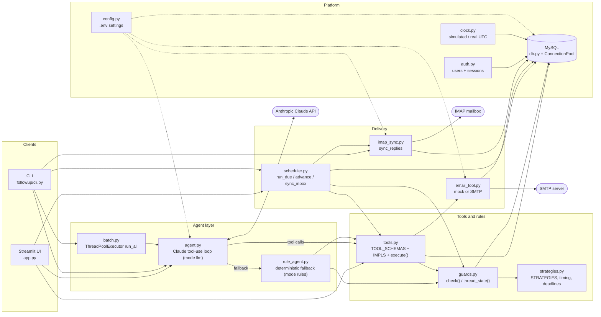
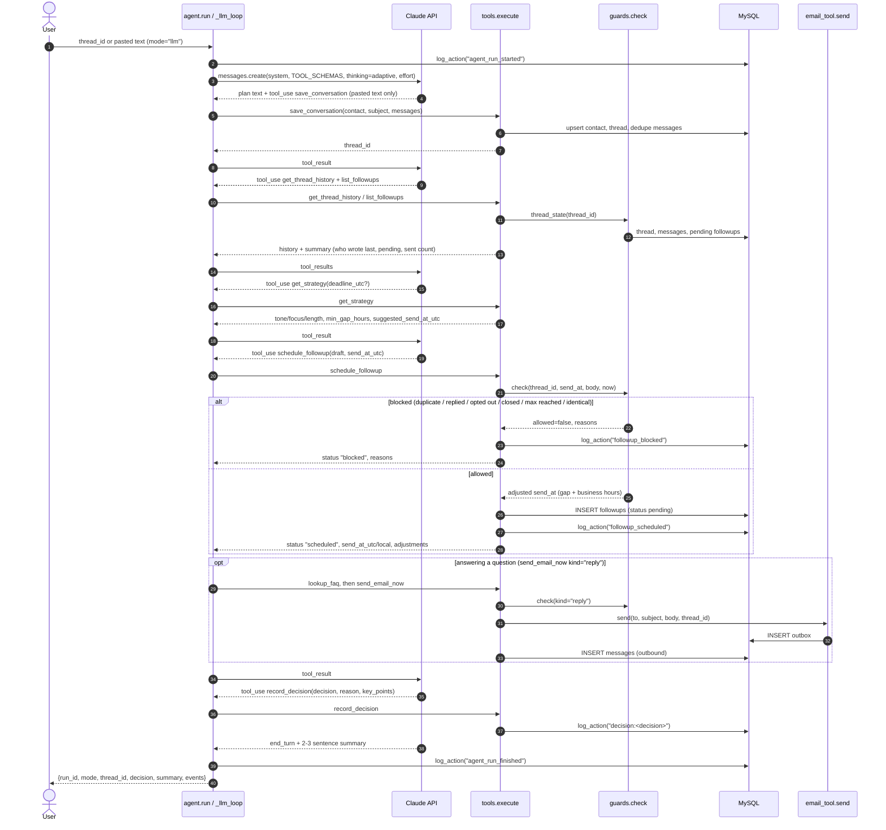
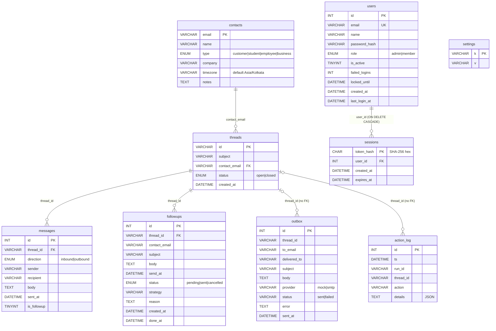
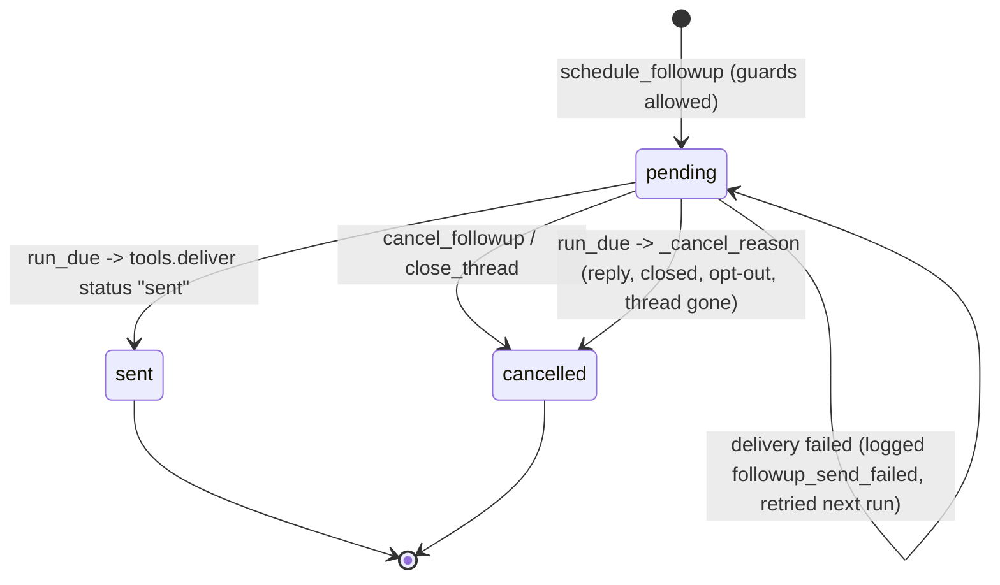

# Architecture: AI Email Follow-Up Agent

Agenticthon 2026, team AGT-018 (Pulkit, Prabhdeep), problem statement PS-053.

This document covers the technical design of the follow-up agent. The agent reads an email conversation, decides whether a follow-up is needed, picks a send time, drafts the message, schedules or sends it through an email tool, and records what it did. It is written for judges and developers. Every module, function, table and constant named here exists in the `followup/` package.

---

## 1. Design principles

1. **Claude decides, code enforces.** Claude (`followup/agent.py`) reasons about the conversation and drafts the message. The hard safety rules (duplicates, opt-outs, minimum gaps, business hours, follow-up caps) live in `followup/guards.py` and run inside the tools. A wrong model decision can therefore never send a duplicate or unwanted email.
2. **The agent always runs.** If the Claude API key is missing or invalid, or the API call fails, the same run continues in the deterministic rules agent (`followup/rule_agent.py`). The rules agent calls the same tools and returns the same result shape.
3. **Every action is recorded.** Each tool call, block, send, cancellation and decision is written to the `action_log` table, tagged with a `run_id`.
4. **The demo is safe by default.** `EMAIL_MODE=mock` writes to the `outbox` table only. In SMTP mode, `SMTP_REDIRECT_TO` sends every real email to a demo inbox. A simulated clock (`followup/clock.py`) lets the demo fast-forward days in seconds.

---

## 2. Component diagram



| Module | Responsibility |
|---|---|
| `followup/agent.py` | `run()` entry point. Runs Claude in a manual tool-use loop (`_llm_loop`, `MAX_ITERATIONS = 15`) and falls back to `rule_agent.run` on auth or API errors. |
| `followup/rule_agent.py` | Offline agent with no API calls. Parses pasted text (`parse_raw`), detects the contact type from keywords (`_guess_type`), drafts from `TEMPLATES`, answers FAQ questions (`draft_reply`), and calls the same tools. |
| `followup/tools.py` | The 11 tools: implementations (`IMPLS`), JSON schemas for Claude (`TOOL_SCHEMAS`), a dispatcher (`execute`), and `deliver()`, which sends an email and stores the outbound message. |
| `followup/guards.py` | Hard rules. `thread_state()` builds a snapshot of a thread. `check()` returns `allowed`, `reasons`, the adjusted `send_at` and `adjustments`. |
| `followup/strategies.py` | Per-contact-type strategy (`STRATEGIES`), business-hours timing (`next_business_slot`), `effective_min_gap`, `suggest_send_at`, and deadline extraction (`find_deadline`, `thread_deadline`). |
| `followup/scheduler.py` | Sends due follow-ups (`run_due`), fast-forwards time (`advance`), syncs replies before sending (`sync_inbox`), and simulates a reply (`simulate_reply`). |
| `followup/email_tool.py` | `send()`: mock (outbox row only) or SMTP with threading headers, redirect and error sanitising. |
| `followup/imap_sync.py` | `sync_replies()`: reads real replies over IMAP and stores them as inbound messages so pending follow-ups get cancelled. |
| `followup/batch.py` | `run_all()`: runs the agent on many threads in parallel. |
| `followup/db.py` | Schema (`SCHEMA`), `ConnectionPool`, helpers (`query`, `one`, `execute`, `cursor`), `reset`/`load_seed`, settings, and `log_action`. |
| `followup/auth.py` | Accounts, scrypt password hashing, hashed session tokens, lockout and roles. |
| `followup/clock.py` | `now()`, `set_now()` and `advance()`. Uses a simulated clock stored in `settings`, or real UTC when `CLOCK_MODE=real`. |
| `followup/config.py` | Loads `.env`: model, effort, MySQL, pool size, email mode, SMTP/MAIL settings and sender name. |
| `followup/cli.py` | Commands: `reset`, `threads`, `run`, `paste`, `advance`, `reply`, `queue`, `outbox`, `log`, `demo`, `test-email`, `sync-replies` and `batch`. |

---

## 3. Agent loop: sequence diagram

The agent follows the six-step workflow written into `SYSTEM_PROMPT` in `agent.py`: (1) save a pasted conversation, (2) check previous communication, (3) decide what the thread needs, (4) choose timing and draft, (5) schedule or send, (6) record the decision.



Loop details (`_llm_loop`):

- Every tool result from one turn goes back to Claude in a single user message.
- `stop_reason` handling: `refusal` stops and reports `stop_details`. `max_tokens` stops. `pause_turn` continues. Any other stop with no tool calls ends the loop.
- If Claude ends without calling `record_decision`, it is reminded once (`nudged`).
- The loop gives up after `MAX_ITERATIONS = 15` turns.
- Events (`info`, `plan`, `thinking`, `tool_call`, `tool_result`, `decision`, `error`) stream to the caller through `on_event` for the live UI timeline and are also returned in `events`.

Possible decisions (enum in the `record_decision` schema): `scheduled`, `sent_now`, `replied`, `skipped`, `blocked_duplicate`, `closed`.

---

## 4. Data model

All datetimes are stored as naive UTC. The schema is created by `db.init_schema()` from `db.SCHEMA`. `db.reset()` drops the tables in `TABLES_DROP_ORDER` and reloads `seed.json`. `users` and `sessions` are not in that list, so accounts survive a demo reset.



| Table | Purpose |
|---|---|
| `contacts` | Recipient, type (selects the strategy) and IANA timezone (sets business hours). |
| `threads` | One conversation per subject and contact; `status` becomes `closed` on opt-out. |
| `messages` | Full history. `is_followup=1` marks our chasers, which count toward `max_followups`. |
| `followups` | The schedule queue: `pending`, then `sent` or `cancelled`, with `strategy`, `reason` and `done_at`. |
| `outbox` | Every send attempt, including the intended recipient (`to_email`) and the actual address (`delivered_to`). |
| `action_log` | Audit trail of every action, tagged with `run_id`. `details` is JSON. |
| `settings` | Key/value pairs. Key `clock` holds the simulated time. |
| `users`, `sessions` | User accounts and login sessions managed by `auth.py` (see section 11). |

---

## 5. Tool catalogue

Defined in `tools.TOOL_SCHEMAS`, implemented in `tools.IMPLS`, and dispatched by `tools.execute(name, args, run_id)`. The dispatcher turns exceptions into `{"error": ...}` so a tool failure never crashes the loop. Write tools in `NEEDS_RUN_ID` receive the run's `_run_id` for logging. Every schema sets `additionalProperties: false`.

| # | Tool | Purpose | Writes |
|---|---|---|---|
| 1 | `save_conversation` | Stores a pasted conversation: upserts the contact (can correct its type), reuses a thread with the same contact and subject or creates a new unique slug id, and skips duplicate messages. | contacts, threads, messages |
| 2 | `get_contact` | Returns a contact's name, type, timezone and threads. | none |
| 3 | `get_thread_history` | Returns the full message history plus a summary: last inbound and outbound times, `recipient_wrote_last`, follow-ups already sent, pending follow-ups, and the current UTC and recipient-local time. | none |
| 4 | `list_followups` | Lists all follow-ups for a contact across all threads, in any status. | none |
| 5 | `get_strategy` | Returns the strategy for the contact type, the effective `min_gap_hours`, and a suggested send time in UTC and local time. Optional `deadline_utc`. | none |
| 6 | `schedule_followup` | Queues a follow-up after `guards.check`. The guards may move the time; if they block it, nothing is queued. Supports `kind` (`followup`/`reply`) and `recipient_promised_update`. | followups, action_log |
| 7 | `send_email_now` | Sends immediately (usually `kind="reply"`). Blocked by the guards, or returns `not_sent` with a scheduling hint when it is outside business hours or too soon. | outbox, messages, action_log |
| 8 | `lookup_faq` | Searches the built-in `PRODUCT_FAQ` knowledge base (keyword scoring, top 3) so replies use documented facts. With no match it returns "do not guess". | none |
| 9 | `cancel_followup` | Cancels a pending follow-up and appends the reason. Returns `noop` if the follow-up is no longer pending. | followups, action_log |
| 10 | `close_thread` | Marks the thread closed and cancels all its pending follow-ups. | threads, followups, action_log |
| 11 | `record_decision` | Writes the final decision and `key_points` to the action log as `decision:<decision>`. Called once, last. | action_log |

---

## 6. Guard rules (`guards.check`)

`check(thread_id, send_at, body, now, ignore_followup_id=None, kind="followup", recipient_promised_update=False, min_gap_hours=None, deadline=None)` runs inside `schedule_followup` and `send_email_now`, and before scheduling in the rules agent. The scheduler repeats the reply and opt-out checks at send time (section 8).

**Blocking rules** (any one sets `allowed=False` and adds a reason):

| Rule | Condition |
|---|---|
| Closed thread | `threads.status == 'closed'` |
| Opt-out or decline | The last inbound message contains one of `CLOSING_PHRASES`: "not interested", "unsubscribe", "stop emailing", "remove me", "no longer need", "we went with another", "decided to go with", "please don't contact" |
| Recipient replied | For `kind="followup"`: they wrote last and `recipient_promised_update` is false. The agent should answer them instead of chasing. |
| Nothing to reply to | For `kind="reply"`: we already sent the last message. |
| Duplicate | Another follow-up for the thread is already `pending` (the one being edited is excluded via `ignore_followup_id`). Does not apply to replies. |
| Follow-up cap | The number of sent follow-ups (`is_followup=1`) has reached the strategy's `max_followups`. Does not apply to replies. |
| Identical text | The whitespace- and case-normalised body equals a message we already sent in this thread. |

**Time adjustments** (recorded in `adjustments`):

1. The send time is never earlier than `now`.
2. Minimum gap (follow-ups only): at least `effective_min_gap(...)` hours after our last outbound message. If `recipient_promised_update` is set, the gap counts from the later of our last message and their last message. The deadline comes from the caller or from `strategies.thread_deadline`.
3. Business hours: the time is moved into `next_business_slot` (Mon to Fri, 09:00 to 18:00, recipient local time).

---

## 7. Timing algorithm (`strategies.py`)

### Per-type strategies (`STRATEGIES`)

| Type | `delay_hours` | `max_followups` | `deadline_lead_hours` | Tone | Length |
|---|---|---|---|---|---|
| customer | 48 | 3 | none | warm, helpful, low-pressure | 60-110 words |
| student | 24 | 2 | 24 | clear, encouraging, supportive | 50-90 words |
| employee | 24 | 2 | 24 | direct, polite, brief | 30-70 words |
| business | 96 | 2 | none | formal and professional | 70-120 words |

Each strategy also has a `focus`. For example, business follow-ups offer two concrete time slots, and student reminders name the deadline and the exact action needed. An unknown type falls back to `customer`.

### Constants

- `WORK_START, WORK_END = 9, 18`: recipient business hours, Monday to Friday.
- `MIN_GAP_HOURS = 24`: normal minimum gap between two of our messages in a thread.
- `DEADLINE_MIN_GAP_HOURS = 12`: the deadline exception described below.

### `suggest_send_at(contact_type, last_outbound, now, tz, deadline)`

```
base = (last_outbound or now) + delay_hours
if deadline and type has deadline_lead_hours:
    base = min(base, deadline - deadline_lead_hours)     # pull earlier for deadlines
if last_outbound:
    base = max(base, last_outbound + effective_min_gap(...))
base = max(base, now + 5 minutes)
return next_business_slot(base, tz)
```

### The 12-hour deadline gap exception (`effective_min_gap`)

The gap is normally 24 hours. For deadline-driven types only (student and employee, which have `deadline_lead_hours`) with a known future deadline:

1. Compute the normal slot: `next_business_slot(max(last_contact + 24h, now + 5min))`. If it is before the deadline, keep 24 hours.
2. Otherwise compute the short slot with 12 hours. If that lands before the deadline, use **12 hours**.
3. If even 12 hours is too late, keep 24 hours. A reminder that would arrive after the deadline is pointless, so the rule is not relaxed further.

`get_strategy`, `suggest_send_at` and `guards.check` all call `effective_min_gap`, so the suggested time and the hard rule always agree. When the gap is shortened, the guard adds the note "(shortened so the reminder lands before the deadline)".

### Deadline detection (`find_deadline`, `thread_deadline`)

`DEADLINE_RE` matches phrases such as "due 3 Oct, 11:59 PM" or "by Friday, 2 October", meaning a keyword (`due`, `deadline`, `by`, `before`), then a day and month, then an optional year and time. A date without a time means 18:00 recipient local time. `thread_deadline` searches the subject first, then our outbound messages from newest to oldest, and returns the first deadline still in the future, as naive UTC.

### `next_business_slot(utc_dt, tz)`

Converts the time to the recipient's zone. A weekend moves to Monday 09:00, a time before 09:00 moves to 09:00 the same day, and a time at or after 18:00 moves to 09:00 the next day (repeated until valid, at most 14 steps). The result is converted back to naive UTC.

---

## 8. Scheduler lifecycle (`scheduler.py`)



`run_due(run_id=None, sync=True)`:

1. **Reply sync first.** `sync_inbox()` runs when `EMAIL_MODE == "smtp"` and a mailbox login is configured. It calls `imap_sync.sync_replies()`, which stores new replies as inbound messages. It never raises, and its result is logged as `reply_sync`. A reply that arrived since scheduling therefore cancels the follow-up instead of being chased.
2. Selects `followups` where `status='pending' AND send_at <= now`, ordered by `send_at, id`.
3. For each one, `_cancel_reason()` checks the thread again: thread missing, thread closed, any inbound message with `sent_at >= created_at` (a reply after the follow-up was scheduled), or an opt-out phrase in the last inbound message. If any applies, the row becomes `cancelled`, `| auto-cancelled: <reason>` is appended to `reason`, and `followup_auto_cancelled` is logged.
4. Otherwise `tools.deliver(..., is_followup=True)` sends the email. On success the row becomes `sent` with `done_at`, and `followup_sent` is logged. On failure `followup_send_failed` is logged and the row stays `pending`.

`advance(hours)` fast-forwards the simulated clock. It stops at each pending `send_at` on the way (`clock.set_now`), so every follow-up is sent and timestamped at its scheduled time. It syncs the inbox once and logs `clock_advanced`. `simulate_reply(thread_id, body)` inserts an inbound message for the demo and logs `reply_received`.

**IMAP reply sync** (`imap_sync.sync_replies(since_days=7)`) searches the mailbox for messages from known contacts. It skips auto-replies, bounces and messages that are empty after `strip_quoted` removes quoted text. It matches a reply to a thread by the normalised subject (`normalize_subject` removes `Re:`/`Fwd:` prefixes). Redirected demo replies are matched using the `[DEMO redirect - intended for X]` marker. It skips a body already stored for that thread, inserts the new inbound message and logs `reply_synced`.

---

## 9. Email delivery (`email_tool.py`)

`send(to_email, subject, body, thread_id)` always writes an `outbox` row and never raises.

| | `EMAIL_MODE=mock` (default) | `EMAIL_MODE=smtp` |
|---|---|---|
| Transport | None. Only the outbox row is written (`provider='mock'`). | `smtplib`. Port 465 uses implicit TLS (`SMTP_SSL`); any other port (default 587) uses `STARTTLS`. `SMTP_TIMEOUT = 20` seconds. |
| Credentials | Not needed | `SMTP_USER`/`SMTP_PASS` or the `MAIL_*` aliases (for Gmail, an App Password). Without them the send is recorded as `failed` with `NOT_CONFIGURED`. |
| Failure | n/a | `status='failed'`. The error is cleaned by `sanitize_error`, which removes the password, including its space-free and base64 forms. |

**Threading headers** (`build_message`): each email gets a unique `Message-ID` (`<fu-<uuid>@domain>`). `In-Reply-To` and `References` both point to a stable per-thread anchor from `thread_message_id()` (`<thread-<id>-<sha1>@domain>`), and `X-Followup-Thread` carries the thread id. Gmail and Outlook therefore group the agent's follow-ups and the contact's replies in one conversation. `Reply-To` defaults to the sender. The body is sent as `text/plain` with a simple escaped `text/html` alternative (`html_body`).

**Redirect safety net:** when `SMTP_REDIRECT_TO` (alias `MAIL_REDIRECT_TO`) is set, every real email goes to that address. The body starts with `[DEMO redirect - intended for <original>]`, and the outbox keeps both `to_email` and `delivered_to`. Live demos can therefore never email real contacts by mistake, and the IMAP sync can still match the replies.

---

## 10. Concurrency

**Batch runs** (`batch.run_all(thread_ids=None, mode="llm", workers=DEFAULT_WORKERS, on_event=None, on_done=None)`):

- A `ThreadPoolExecutor` with `DEFAULT_WORKERS = 4` workers (capped at the number of threads) keeps the agent within Claude API rate limits.
- Agent runs mostly wait on I/O (Claude API, MySQL, SMTP), so threads overlap that waiting even with the GIL.
- `on_event` and `on_done` callbacks are serialised with one lock, so UI and CLI callers need no locking of their own.
- An exception in one thread is caught and stored in `errors`, and the batch continues. `batch_started` and `batch_finished` (decisions, errors, seconds) are logged.
- By default it processes every `open` thread (`open_thread_ids`). CLI: `python -m followup.cli batch [--workers N]`.

**Database connection pool** (`db.ConnectionPool`, size `MYSQL_POOL_SIZE`, default 8):

- Opening a MySQL connection takes about 40 ms on Windows, so `db.cursor()` borrows a pooled autocommit connection and returns it afterwards.
- `acquire()` pings an idle connection (`ping(reconnect=False)`) and replaces it if it is dead. Each connection is tagged with the factory that created it, so a patched `db._connect` in tests never receives a stale connection.
- A connection that raised `pymysql.err.OperationalError` is closed rather than returned to the pool. At most `max_idle` connections stay open, and the rest are closed. `stats()` reports idle, created and reused counts.
- Each connection is used by only one thread at a time, so batch workers share no connection state.

---

## 11. Authentication (`auth.py`)

| Concern | Design |
|---|---|
| Password hashing | `hashlib.scrypt` (N=2^14, r=8, p=1, 32-byte key) with a random 16-byte salt per user, stored as `scrypt$n$r$p$salt_hex$hash_hex`. Verified with `hmac.compare_digest`. |
| Password policy | At least `MIN_PASSWORD_LEN = 8` characters, and not all digits or all letters. |
| Sessions | The client receives a `secrets.token_urlsafe(32)` token. Only its SHA-256 (`sessions.token_hash`) is stored, so a leaked sessions table cannot be replayed. Sessions last `SESSION_HOURS = 12`, and expired rows are deleted each time a session is created. |
| Brute force | After `MAX_FAILED = 5` wrong passwords the account is locked for `LOCK_MINUTES = 15`. Unknown emails and wrong passwords return the same message (`LOGIN_FAILED`), and unknown emails still spend a scrypt hash (`_DUMMY_HASH`) so response time does not reveal which emails exist. |
| Roles | `admin` (manage users, reset demo data, time travel) and `member`. The first account created is always admin. Admins cannot demote or disable themselves (`set_role`, `set_active`). |
| Session revocation | `logout`, `logout_everywhere`. Changing a password or disabling an account revokes all sessions. |
| Clock | Expiry and lockout use real UTC (`_utcnow`), not the simulated demo clock. |
| Audit | `user_registered`, `login_success`, `login_failed`, `password_changed`, `user_role_changed` and `user_active_changed` go to `action_log`. |

---

## 12. LLM configuration (`agent.py`, `config.py`)

| Setting | Value |
|---|---|
| Model | `CLAUDE_MODEL` env var, default `claude-opus-5-5`. |
| Effort | `CLAUDE_EFFORT`, one of `EFFORT_LEVELS` (`low`, `medium`, `high`, `xhigh`, `max`). Invalid values fall back to `medium`. Sent as `output_config={"effort": ...}`. |
| Thinking | Adaptive: `thinking={"type": "adaptive", "display": "summarized"}`. Summarised thinking is streamed to the UI as `thinking` events. |
| Output budget | `max_tokens=16000` per turn. |
| Prompt caching | `cache_control={"type": "ephemeral"}`, because the system prompt, tools and history are re-sent every iteration. |
| Client | `anthropic.Anthropic(timeout=180.0, max_retries=2)`. The SDK retries 429, 5xx and network errors. |
| Refusal fallback | Requests go to the beta endpoint with `betas=[FALLBACK_BETA]` (`server-side-fallback-2026-07-01`) and `fallbacks="default"`, so a refused request is handed to a fallback model. `_echo_content` drops the refused attempt's thinking and tool blocks and the `fallback` marker before echoing the content back. Only the accepting model's tool calls are executed. If the API rejects the beta (400), the run switches to the plain endpoint (`ctx.use_fallbacks = False`). |
| Rules fallback | With no `ANTHROPIC_API_KEY`/`ANTHROPIC_AUTH_TOKEN`, or on an auth error (401/403), the run emits `AUTH_FALLBACK_MSG` and continues in `rule_agent.run`. Any other `AnthropicError` also falls back to the rules agent. The run keeps its `run_id` and event list, and the result reports `mode: "rules"`. |
| Credentials | `config.py` makes Claude credentials in `.env` take priority over values exported in the parent shell, without modifying `.env`. |

---

## 13. Testing strategy

**173 tests** (`python -m pytest -q tests --co -q`) run against a throw-away MySQL database, `followup_agent_test`, with no network access:

| File | Tests | Covers |
|---|---|---|
| `tests/test_guards.py` | 38 | Each blocking rule, gap and business-hour adjustments, replies, promised updates |
| `tests/test_strategies.py` | 33 | Strategies, `next_business_slot`, `suggest_send_at`, deadline parsing |
| `tests/test_tools.py` | 24 | Tool implementations, `save_conversation` dedupe and thread ids, `execute` |
| `tests/test_email_tool.py` | 17 | Mock and SMTP paths, headers, redirect, error sanitising |
| `tests/test_auth.py` | 15 | Hashing, sessions, lockout, roles |
| `tests/test_scheduler.py` | 14 | `run_due`, auto-cancel on reply/close, failed sends stay pending and retry, `sync_inbox` before sending, `advance` |
| `tests/test_deadline_gap.py` | 13 | The 12-hour deadline exception end to end |
| `tests/test_agent_mock.py` | 9 | The Claude loop against a scripted `FakeAPI`: tool execution, effort validation, decision nudge, iteration cap, refusal-fallback block filtering, beta rejection retry, rules fallback on 401 / missing key / 5xx |
| `tests/test_imap_sync.py` | 4 | IMAP configuration checks, CLI `sync-replies`, login failure reported rather than raised |
| `tests/test_pool.py` | 4 | Pool reuse, no connection sharing across threads, dead-connection replacement, factory swap |
| `tests/test_batch.py` | 2 | Parallel `run_all` and error isolation |

Test design:

- `tests/conftest.py` sets `MYSQL_DATABASE=followup_agent_test`, `CLOCK_MODE=sim` and `EMAIL_MODE=mock` before importing `followup`. It refuses to run against any other database.
- The schema is built once per session with `db.reset()` from an inline seed. Each test re-seeds by deleting rows and calling `load_seed`, and the suite shares one connection.
- The clock is pinned to Thursday 2026-10-01 05:30 UTC (11:00 IST, inside business hours), so timing assertions are deterministic.
- The Claude API is replaced by `FakeAPI` (monkeypatching `agent.anthropic.Anthropic`), so agent-loop tests need no API key and use no tokens.

Run the tests: `python -m pytest -q tests` (requires a local MySQL server).
